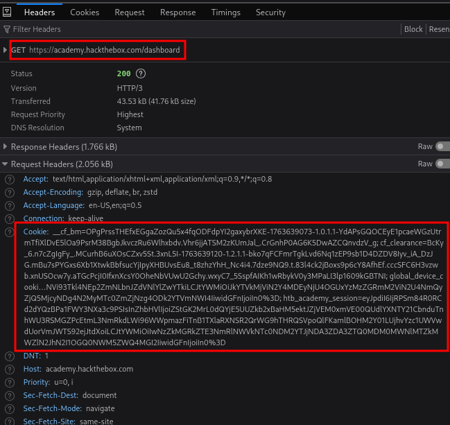

# 🖥️ HTB Module Parser

**Convert any unlocked HackTheBox Academy module into a full offline HTML package** - including images, assets, syntax highlighting, and a TOC sidebar. ⚙️📘

This tool was tested on **50+ modules** without errors. Perfect for offline studying or archiving.

## 🎬 Tutorial & Cookie Guide (Resources)

* ▶️ **Video Tutorial**
  [Tutorial Vid.mp4](https://github.com/user-attachments/assets/3dfe5baa-699f-43a4-892d-8ba188fed893)

* 🍪 **How to get your Cookie (Screenshot)**
  

Both files are located in the **`resources/`** folder of the repository.

---

## ⚙️ How to Set Up & Use (Step-by-Step)

### 1️⃣ Install Requirements

Install the Python packages needed by the script:

```bash
pip install requests beautifulsoup4 markdown pygments
```

### 2️⃣ Get Your HTB Session Cookie

You must be **logged in** to academy.hackthebox.com to download module content.

Follow this mini-guide:

1. Open **Developer Tools** (F12)
2. Go to the **Network** tab
3. Click any request from `academy.hackthebox.com`
4. Find the **Request Headers**
5. Copy the **Cookie** field
6. Paste it into `cookie.txt`

✔ Refer to the screenshot here:


✔ Or watch the video tutorial here:
[▶️ Tutorial Vid.mp4](resources/Tutorial%20Vid.mp4)

### 3️⃣ Run the Offline Module Generator

Basic usage:

```bash
python generate_offline.py --module <MODULE_ID>
```

Example:

```bash
python generate_offline.py --module 278
```

You can also provide your cookie manually:

```bash
python generate_offline.py --module 278 --cookie "auth_sid=..."
```

### 4️⃣ Where to Get the Module ID?

Check the module URL:

```
https://academy.hackthebox.com/beta/module/278
```

➡️ The number **278** is the module ID.

### 5️⃣ Output Structure

After parsing, you will get a folder like:

```
278. Web Requests/
│── index.html
│── style.css
│── pygments.css
└── assets/
      ├── 0.html
      ├── 1.html
      ├── 2.html
      ├── image1.png
      └── ...
```

Open:

```
index.html
```

Your module is now **100% offline** and fully navigable.

## 🤝 Contributing

Pull requests are welcome.
Feel free to expand compatibility, add new features, improve UI, or help optimize parsing.

[](https://t.me/scarlettaowner)
[](https://t.me/viperzcrew2)


